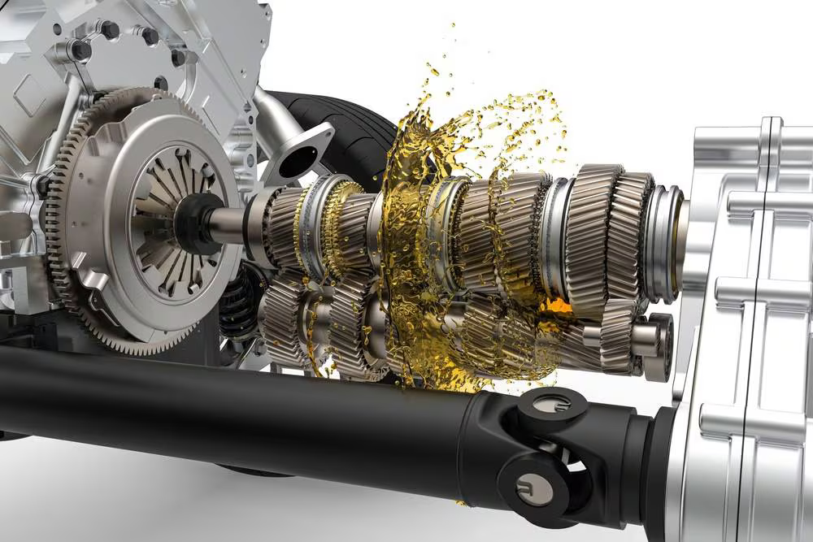
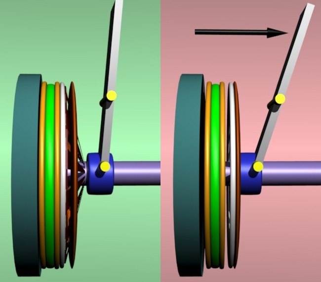
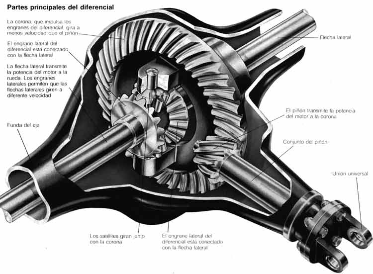
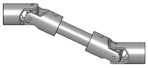

# La trasmision de un Automovil
### ¿Que es la trasmision de un auto?
#### La transmisión es un sistema mecánico que se encarga de transmitir la potencia del motor a las ruedas del vehículo. Es un componente fundamental que permite al conductor controlar la velocidad y el par motor del vehículo.
### Tipos de transmisiones
- Transmisión manual 
- Transmisión automática (continuamente variable)
- Transmisión automatica (de doble embrague)
### Componentes principales de la transmisión
- Caja de Cambios

- Embrague

- Diferencial

- Eje de trasmision
